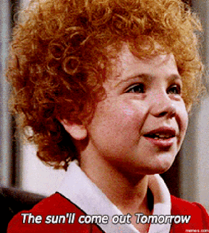

# 🫰 F-It.
### _High-Intensity Interval Training for Programmers_

 

🎶 *When your day is long*  
*And the night, the night is yours alone*  
*When you're sure you've had enough*  
*Of* **[^insert name of project]**, *well hang on*  

*Don't let yourself go*  
*Cause everybody cries*  
*[Everybody hurts](https://youtu.be/FfggUztyO00) sometimes* 🎵

 

This is the at-home physical therapy and meditation retreat (all rolled into one!) you never knew you needed 😉. Ever wish you could just snap your fingers and all the pesky bugs 🐛🪲 in your code would ✨*whoosh*✨, just like that, vanish into thin air? 🤨🤞 Problem solved! Dear programming friends, the solution is right at your fingertips. Literally. To get that SaaS in your snap, you just need more finger strength 💪. (Some knowledge of [American Sign Language](https://www.nidcd.nih.gov/health/american-sign-language) is helpful, but not required.)

_Disclaimer: The information provided herein should not be used for diagnosing or treating a health problem or disease. Always seek the advice of a qualified IT professional or a more experienced software engineer regarding bug-infested code--not to be confused with the creepy-crawly variety. Otherwise, consult Pest Control._

### 💻 **TECH STACK**
HTML, CSS, Javascript

Key JS Topics:  
✅ `keydown` events  
✅ `setTimeOut`  
✅ `setInterval`  
✅ the `DOM`

---

### **RULES OF ENGAGEMENT**

*F-it* is a [CrossFit](https://www.crossfit.com/what-is-crossfit/)-inspired finger workout, using American Sign Language (ASL). Live demo the app [here](https://f-it-rouge.vercel.app/).

Good luck. You got this ⌨️💪.

#### 💪 **LEVEL 1**
If you do not know the ABC's of ASL, this foundation class is designed for you. Experienced signers, feel free to use this as a warm-up.  

⚠️ *You'll need your keyboard for this, touchscreen users.*

#### 💪 **LEVEL 2**
Once you have mastered the fundamentals, you can move on to SPELLING in ASL. You'll be completing your sets ([time under tension](https://www.healthline.com/health/exercise-fitness/time-under-tension)) while...*timed under tension*. Don't uhhh...F-it up.  

+ **AMRAP** (as many reps as possible) - Test how many times you can fingerspell a single word within the alloted 20,000-millisecond (20-second) timeframe. Timer starts as soon as the page loads--no time to lose! (If you get caught off guard--no worries. Wait for the next word to pop up on screen. The exercise changes every 20 seconds.)
+ **EMOM** (every minute on the minute) - You'll be presented with a set of 12 fingerspelling exercises to complete for one minute, at intervals of five seconds per word. Words are selected at random. The one-minute timer starts as soon as you hit the *start* button. The EMOM has no set duration. We recommend repeating each one-minute block [3-5 times](https://twitter.com/hubermanlab/status/1553501345084166144?lang=en) to really build up that muscle memory.

#### 💪 **LEVEL 3**
For fluent ASL signers only. Think: karaoke, but...for your fingers. Can you keep up?! No singing 🚫🎤 required unless...you really want to.

 

Once you've completed all three levels, congratulations, you now possess the pow-pow-POWERRR to 💥A for *annihilate*💥, 💥B for *banish*💥, 💥C for *crush*💥... alllll the bugs in your code with the tap of your *fit AF* fingers 🥳🎉🎊.

Otherwise, if not, take a breather. Get some fresh air. Eat some good food. Sleep well, tomorrow is a new day 🌞.

---
### **TECHNICAL DETAILS**

📁 Root directory:
1. 4 *.html* files:
    + *index.html* - this is the homepage
    + *level1.html*
    + *level2.html*
    + *level3.html*
2. _README.md_ & _tomorrow.gif_ (from [GIPHY](https://giphy.com/gifs/tomorrow-mFz5kzbDKtwha) by [Memes](https://memes.com/), used in _README.md_)

 

📁 Subdirectories (3 subfolders):
1. 📂 *assets* (one subfolder + 4 image files):  
   + 📂 *alphabet* folder (26 *svg* files, one for each ASL alphabet) - All are from [Wikimedia Commons](https://commons.wikimedia.org/wiki/Fingerspelling) by [WPClipart](https://www.wpclipart.com/sign_language/American_ABCs/index.html).  
   + *binary_swirl.png* - from [Pixabay](https://pixabay.com/vectors/binary-random-numbers-digital-ones-1254482/) by [GDJ](https://pixabay.com/users/gdj-1086657/)  
   + logos (*logo32.png* & *logo256.png*) - both from [Flaticon](https://www.flaticon.com/free-icon/easy-to-use_4456893) by [Freepik](https://www.flaticon.com/authors/freepik)  
   + *power-finger.gif* - from [GIPHY](https://giphy.com/gifs/money-twitter-tweet-3IUZ9PpKfTEUQNb4od) by [Antony Hare](https://giphy.com/antonyhare/)

 

2. 📂 *scripts* (6 *.js* files): 
   + `alphabet.js` - used by `level1.html` 
      + Listens for `keydown` events, and changes the page's content according to event key (i.e., the keyboard key that corresponds to one of the 26 letters of the alphabet).
      + The `Popover.js` & `bootstrap.min.js` scripts are also included in `level1.html` to use Bootstrap's tooltips. Each tooltip contains the corresponding letter to each displayed ASL alphabet image, on hover over the image.  
   + `copyright.js` - used by all 4 *.html* files
      + Programmatically generates the copyright year and footer text.   
   + `speller.js` - used by `level2.html`
      + This script contains 7 functions:  
         1. `getRandomInteger`
            + This is a helper function for `pickWord`.
            + Returns a random integer based on a specified range. Accepts two arguments: 
               + the min value within the range
               + the max value within the range
         2. `pickWord`
            + This is a helper function for `updateContent`.
            + Calls `getRandomInteger` to get a random index number.
            + Returns an array of characters (single-letter strings) that make up a randomly chosen word from the `words` array--using a random number from `getRandomInteger` to index into it.
         3. `getASLImages`
            + This is another helper function for `updateContent`.
            + Returns a container `
` that holds the ASL *svg* equivalent of each character in the `wordArr` argument. 
            + An `` element is created for each character in the word array, then appended to the container `
`. 
            + File paths to the *svgs* are stored in the `alphabets` object, and are accessible by the alphabet key that matches the file name. 
               + E.g., The property name used to access the path to the *a.svg* file in the `alphabets` object, for ASL letter 'A' is--"a".
            + The *svg*s, together, inside the container `
`, spell out the joined characters of `wordArr`--in ASL.
            + Once the text is translated to image, this function removes all previous images from the DOM--based on its `containerEL` and `num` arguments.
               + The `num` argument tells the function to remove `containerEL`'s second child if `containerEL` is the AMRAP `
`, but its
              third child if the EMOM `
`.
         4. `getImgCaption`
            + This is yet another helper function for `updateContent`.
            + Returns a `
` element containing the "fingerspell [joined characters from word array]" caption under the ASL images.
            + Once the new caption text has been created, this function removes the previous caption from the DOM--based on its `containerEL` and `num` arguments.
               + The `num` argument tells the function to remove `containerEL`'s third child if `containerEL` is the AMRAP `
`, but its 
              fourth child if the EMOM `
`.
         5. `updateContent` 
            + Accepts three arguments:  
              1. `containerEl` (HTML element) - This is the parent element of both the ASL images and caption text. Since we have two different `
`'s that need to be updated, we need a way to reference the AMRAP and EMOM `
`s to know which to update.
              2. `childElNum1` (integer) - This is the image container `
`'s index number in the `containerEl`'s `children` property, used by `getASLImages` to identify which child element needs to be removed from the DOM when a new set of images has been created to replace it.
              3. `childElNum2` (integer) - This is the `
` element's index number in the `containerEl` 's `children` property, used by `getImgCaption` to identify which child element needs to be removed from the DOM when a new caption has been created to replace it.
            + Calls the `pickWord`, `getASLImages`, and `getImgCaption` functions.
              + `pickWord` - its return value (an array of characters) is passed in to both `getASLImages` and `getImgCaption` for processing.
              + `getASLImages` - `childElNum1` and `containerEl` are also passed in as arguments.
              + `getImgCaption` - `childElNum2` and `containerEl` are also passed in as arguments.
            + Lastly, this function appends the new content (namely, the return values of `getASLImages` and `getImgCaption`) to the DOM.
         6. `startEmom`
            + This is the `click` event handler for the EMOM *start* button. 
            + Sets up a timer using `setTimeout` to display a new ASL word and caption every five seconds--using `setInterval` to call `updateContent`--for one minute.
         7. `startAmrap`
            + This function calls `updateContent` to generate a new ASL word and caption every 20,000ms using `setInterval`--only for as long as the page remains open and visible in both the current browser tab and browser window.
            + When a change in the page's `visibilityState` is detected, a page reload will be required to reset the interval if it was cleared by either minimizing the window or by switching browser tabs.
   + `swirl.js` - used by `index.html`
      + Controls the swirl animation when homepage loads.   
   + `video.js` - used by `level3.html`  
   + `yellow.js` - used by all 4 *.html* files
      + Controls the yellow hover effect that appears over the page, on hover over any of the three links (*level 1*, *level 2*, *level 3*) inside the triangle-shaped navigation.

 

3. 📂 *stylesheets* (5 *.css* files):  
    + *styles.css* - general stylesheet used by all 4 *.html* files
    + *index.css* - used by *index.html*
    + *level1.css* - used by *level1.html*
    + *level2.css* - used by *level2.html*
      + *start* button is styled with Bootstrap.
    + *level3.css* - used by *level3.html*
      + *watch live demo* buttons are styled with Bootstrap.